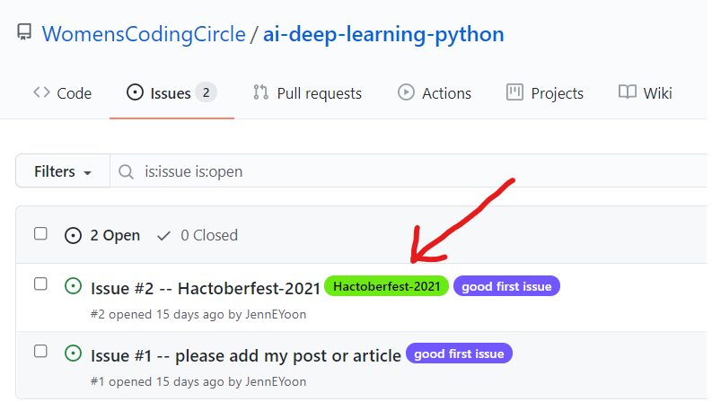
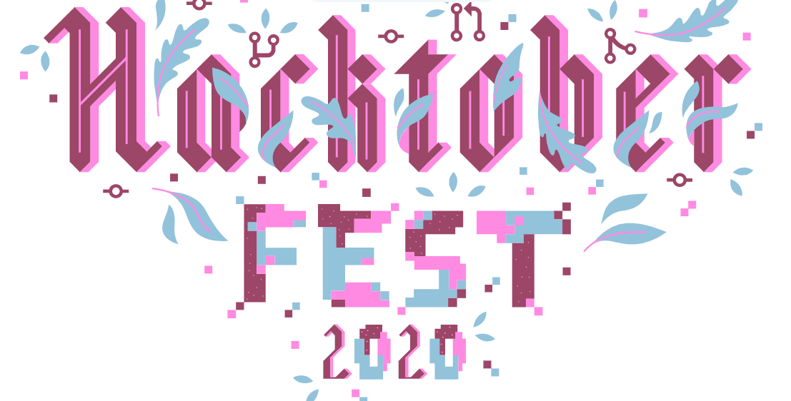

# We will be participating in Hactoberfest 2021  

In addition to being a good resource to WCC members on AI and Deep Learning topics, we will be using this repo for Hactoberfest 2021.  What is Hactoberfest?  It is a global celebration of hackers who want to contribute to open source projects.  There are free T-shirts and bragging rights for completing the event.  For newbies, it's a great time to get to know Github a little better and get involved in newbie friendly open-source projects.  I will be monitoring new pull-requests actively during the month of October 2021, so please come and become a Hactoberfest Challenger in 2021! :-D  Woohooooo  It's Octoberfest for hackers and coders.  

See 2020 Hactoberfest page  
https://hacktoberfest.digitalocean.com/  

### For 2021 participation, look for "Hactoberfest-2021" label in Issues tab (top menu)  

  
  
### Link to stats from Hactoberfest 2020:  
  - https://hacktoberfest.digitalocean.com/  
  - 66,739 people completed the challenge  
  - 387,052 successful pull requests were created  
  - free t-shirts awarded globally  

