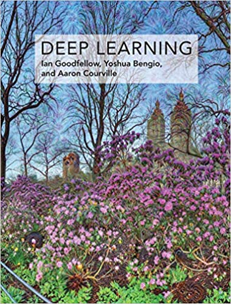

#  Books Top 5, for machine learning and deep learning  

### Hactoberfest-2021 Instructions:  

Please edit this file by adding **Top-5 books** you would recommend.  Add to the end of the file.  Plase add your name, your GitHub username, and #hactoberfest-2021, somewhere above or below your list. For more instructions, please see:  
 * Hactoberfest_2021_instructions.md  
 * issue #2, in "issues" tab, top-menu.  

### Top-5 books:   
By Jennifer E. Yoon, Github user: JennEYoon, \#hactoberfest-2021    
  
 1. Howard and Gugger, ***Deep Learning for Coders with Fastai and PyTorch***, c 2020  
   After working through VanderPlas, fastai has the best beginner book for deep learning.
     - Amazon book:  https://www.amazon.com/Deep-Learning-Coders-fastai-PyTorch/dp/1492045527/ref=sr_1_1?dchild=1&keywords=fastai&qid=1603575065&sr=8-1   
     - fastbook github: https://github.com/fastai/fastbook  
     - fastai v2 library github: https://github.com/fastai/fastai 
     - Fast.ai website:  https://www.fast.ai/  
     - Colab notebooks:  https://course.fast.ai/start_colab    
     - Youtube playlist for 2020 version, Part-1 Practical Code:  
       https://m.youtube.com/playlist?list=PLfYUBJiXbdtRL3FMB3GoWHRI8ieU6FhfM&noapp=1  
     - Youtube playlist for 2019 vesion, Part-2 Foundations:  
       https://m.youtube.com/playlist?list=PLfYUBJiXbdtTIdtE1U8qgyxo4Jy2Y91uj   
     - Youtube playlist for fastai v2 library, 2020 release:  
       https://m.youtube.com/playlist?list=PLfYUBJiXbdtSWRCYUHh-ThVCC39bp5yiq  
       
 2. **New** -- Magnus Ekman, NVIDIA Deep Learning Institute, Learning Deep Learning, c 2022 NVIDIA Corporation, Addison-Wesley publisher.  
     - Has 666 pages of very thorough instructions and very clear color graphics that lays out the current state of deep learning using TensorFlow. The exhibits and cheatsheets at the end are exceptionally good and is worth the price of the book by itself. I would not call it a beginner's book. But if you are somewhat comfortable with calculus and linear algebra and have 1 year of daily programming experience, then it would be suitable even as your first book on deep learning.   

 3. VanderPlas, ***Python Data Science Handbook***, c 2017     
   Best book for learning Python data science libraries, i.e. NumPy, MatplotLib, Pandas, Scikit-learn, and Jupyter/iPython.  
    - Link: https://jakevdp.github.io/PythonDataScienceHandbook/        
       
 4. Goodfellow et al., ***Deep Learning Book***   
   Has more math and theory. Is a definitive reference.     
     - Link: http://www.deeplearningbook.org/  
     - free book:  <a href="./books/Goodfellow-Deep-Learning.pdf" alt="Goodfellow">
     > </a>

 5. James, Witten, Hastie, Tibshirani, ***An Introduction to Statistical Learning with Applications in R***, c 2013.   
   8th printing with corrections, c 2017.  
   Very good place to start for a beginner to machine learning. Python codes available by others on Github.   
     - main website:  http://faculty.marshall.usc.edu/gareth-james/ISL/  
     - free book:  http://faculty.marshall.usc.edu/gareth-james/ISL/ISLR%20Seventh%20Printing.pdf   
     - class:  https://lagunita.stanford.edu/courses/HumanitiesSciences/StatLearning/Winter2016/about   
  
 * See also **3 Blue and 1 Brown** YouTube playlist on ***Neural Networks***.   
   This guy has very good visual summaries of complex math problems.  
   The Neural Networks playlist is a very good summary of visual deep learning.  
     - Link: https://www.youtube.com/playlist?list=PLZHQObOWTQDNU6R1_67000Dx_ZCJB-3pi   
 
### More books:  

 * **Update** -- Chollet, ***Deep Learning with Python***, 2nd ed.  
   Learning Keras/TensorFlow and basic deep learning concepts from the developer of Keras.  
   The 2nd edition has 50% more content with 5 new chapters. Final version available around Novemver 2021. MEAP version available online from Manning.  
     - https://livebook.manning.com/book/deep-learning-with-python-second-edition/chapter-1/v-7/ (2nd ed. v7)
     - https://www.manning.com/books/deep-learning-with-python (1st ed.)
     
 * Juan Nunez-Iglesias et al., ***Elegant-Scipy***, c 2017.  
   Best book for learning Python Scipy library. Authors are also core developers for Scikit-Image library.   
     - Link: https://notebooks.gesis.org/binder/jupyter/user/elegant-scipy-notebooks-bulvssc8/notebooks/index.ipynb  
     - Github repo: https://github.com/elegant-scipy/elegant-scipy  

 * Hastie, Tibshirani, Friedman, ***Elements of Statistical Learning***, 2nd ed., c 2009   
   Older book. Is math amd theory heavy. Definitive reference.   
     - https://web.stanford.edu/~hastie/ElemStatLearn/  

 * Bishop, ***Pattern Recognition***, c 2006.   
   Math and Concepts.  Oldie but goodie, and is a definitive reference.  
     - Link: https://www.microsoft.com/en-us/research/uploads/prod/2006/01/   
     - Bishop-Pattern-Recognition-and-Machine-Learning-2006.pdf  

### Please feel free to add your top-5 picks below!  

-----   

### Top-5 books:   
By \<your name\>, Github user: \<your github username\>, \#hactoberfest-2021  
  
  1. - book  

  2. - book    
  
  3. - book    
  
  4. - book  
  
  5. - book  

-----  

### Top-5 books:   
By \<your name\>, Github user: \<your github username\>, \#hactoberfest-2021  
  
  1. - book  

  2. - book    
  
  3. - book    
  
  4. - book  
  
  5. - book  

-----  

### Top-5 books:   
By \<your name\>, Github user: \<your github username\>, \#hactoberfest-2021  
  
  1. - book  

  2. - book    
  
  3. - book    
  
  4. - book  
  
  5. - book  

-----  

---  
<eof>  
